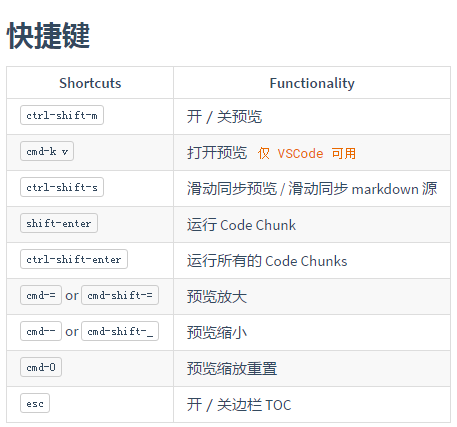

####  关于使用vscode编写markdown

---
vscode本身是支持markdown预览的

我安装了Markdown Preview Enhanced插件，可以支持更多的功能，比如本地预览，浏览器预览


打开markdown文件，mac系统按cmd+k 再按V键|windows系统按ctrl+k 再按V键 就可以边写边预览了

--- 
### markdown 语法
https://shd101wyy.github.io/markdown-preview-enhanced/#/zh-cn/markdown-basics

example:
*这会是 斜体 的文字*
_这会是 斜体 的文字_

**这会是 粗体 的文字**
__这会是 粗体 的文字__

_你也 **组合** 这些符号_

~~这个文字将会被横线删除~~

* Item 1
* Item 2
  * Item 2a
  * Item 2b




http://github.com - 自动生成！
[GitHub](http://github.com)

正如 Kanye West 所说：(引用)

> We're living the future so
> the present is our past.

如下，三个或者更多的

---

连字符

***

星号

___

下划线

我觉得你应该在这里使用
`<addrdfd>` 才对。

`dfsdfsaf`

```
fadf
fasdf
asfd
```

代码块
```js {.line-numbers}
var a = "";
if (a && a != 0) {
    //todo
} else {

}
```

- [x] @mentions, #refs, [links](), **formatting**, and <del>tags</del> supported
- [x] list syntax required (any unordered or ordered list supported)
- [x] this is a complete item
- [ ] this is an incomplete item


First Header | Second Header | weeeeeeeee
------------ | ------------- | -------
Content from cell 1 | dfsdf     |  
Content in the first column | ^  |

==marked==