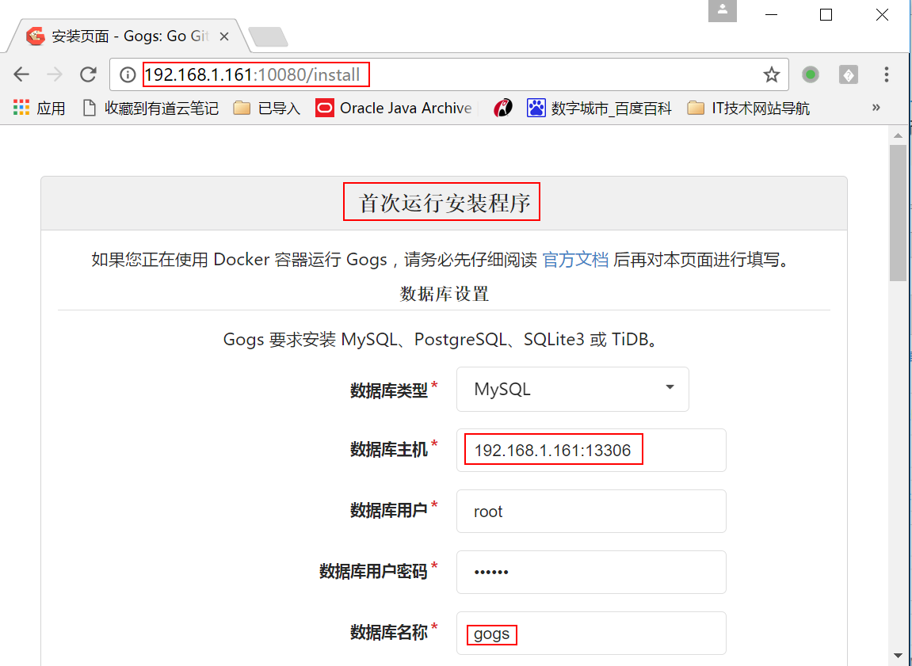
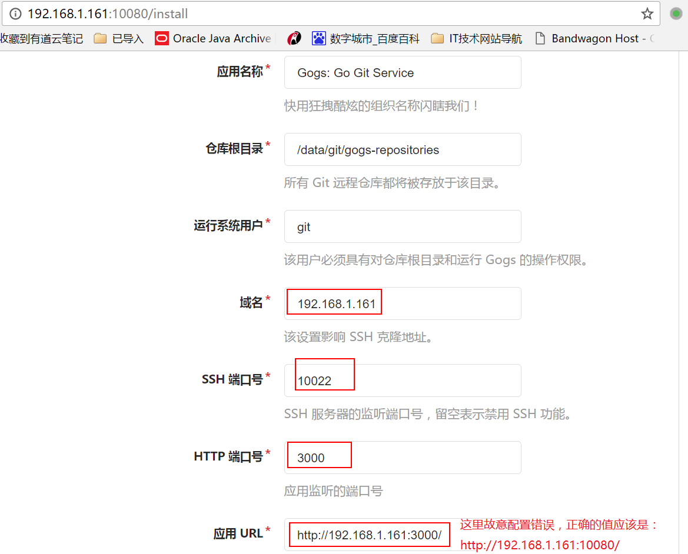
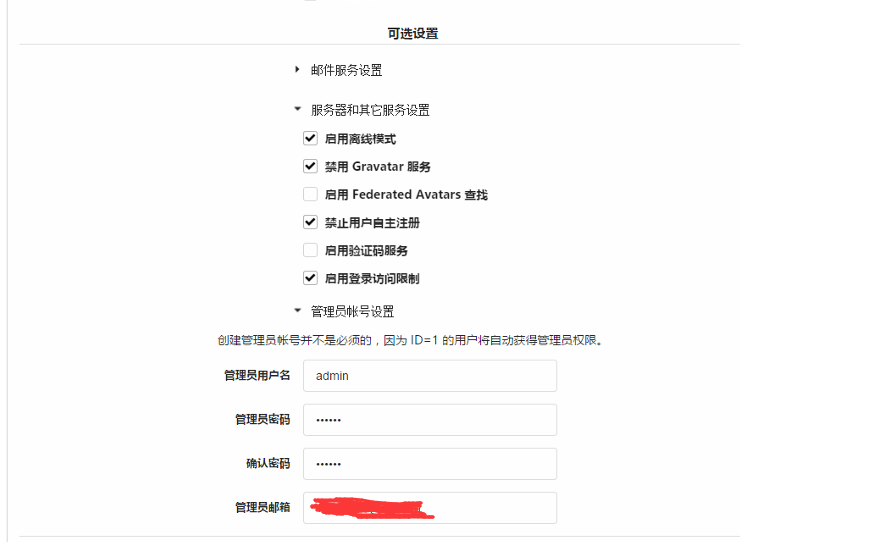
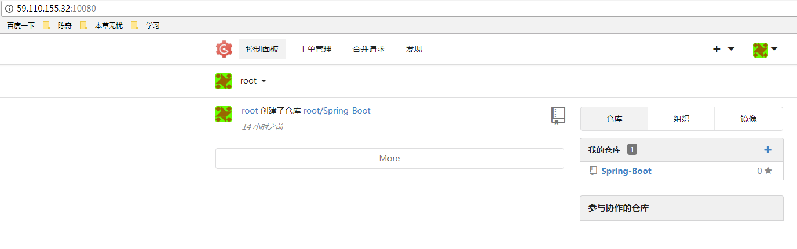
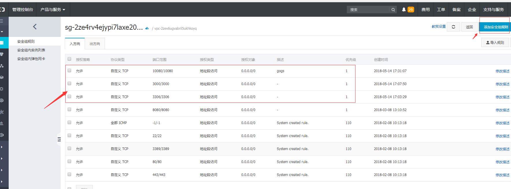

## Gogs搭建
---

### <font color=0099ff size=3>前言</font>
空闲时间，使用docker方式，搭建gogs，用来进行项目版本控制。阅读这篇博客时，我假定你之前有过基本的docker使用经验或者至少对docker有着一定的了解。否则，建议你使用这种方式去搭建，传送门：[庆爷搭建gogs的心酸历程](http://huangqing.top/2018/05/09/Gogs%E6%90%AD%E5%BB%BA%E7%89%88%E6%9C%AC%E6%8E%A7%E5%88%B6%E5%B7%A5%E5%85%B7/)

### <font color=0099ff size=3>What is Gogs?</font>
一款极易搭建的自助`Git`服务，用来进行代码版本控制。

优点：Gogs, 用 docker 跑很方便，外观也漂亮，轻巧简洁，运行快速，几百人使用完全可以满足。

比较：关于私有化git服务，目前了解的有 `gitlab`，`gitblit`，`gittea` 和 `Gogs`。上家公司用的gitlba，现在公司用的gitblit。
gitlab:Gitlab 功能很全，但你需要一个配置足够好的机器来跑，毕竟集成了太多的东西，比较耗内存，慢。自己手动搭建会比较复杂，推荐使用官方的docker image，搭建起来会容易一点。

ps:具体选择要看应用场景，以及服务器的配置等......

### <font color=0099ff size=3>安装gogs</font>
您可以通过以下 5 种方式来安装 Gogs：

二进制安装
源码安装
包管理安装
采用 Docker 部署
通过 Vagrant 安装 
我是用的第4种 “采用 Docker 部署”,其他安装方式请点[这里](https://github.com/gogits/gogs/blob/master/README_ZH.md)
1、安装docker。 
2、安装mysql。 
3、拉取gogs镜像。 
4、启动gogs容器
5、然后在浏览器中访问http://服务器IP:3000/,就可以打开web安装界面，进行相应的配置，然后，你就可以玩了。

### <font color=0099ff size=3>Docker方式安装gogs</font>
#### 系统环境
阿里云服务器 Ubuntu 16.04.3 LTS 

#### 安装Gogs所需环境
1.安装nginx 
```
sudo apt-get install nginx 
```
2.安装git
```
sudo apt-get install git
```
3.安装MySQL
```
sudo apt-get install mysql-server
```
安装mysql会弹出一个框，提示输入数据库密码，这里我输入的123456；输入两次，然后ok，继续安装。

ps:以上3步，你可能会遇到安装失败的情况，可以试试再执行上面的命令前先执行下面一条命令：
```
sudo apt-get update
```

4.创建gogs数据库
// 安装好了mysql,可以使用Navicat或者其他数据库管理工具连接上数据库，创建一个数据库，数据库名：gogs
// 当然也可以直接在服务器上面sql新建，看个人喜爱
// 下面是新建数据库的sql命令
// 登录数据库
mysql -u root -p
// 输入数据库密码：123456 进入到mysql命令行界面,执行下面条命令
```js {.line-numbers}
SET GLOBAL storage_engine = 'InnoDB';
CREATE DATABASE gogs CHARACTER SET utf8 COLLATE utf8_bin;
GRANT ALL PRIVILEGES ON gogs.* TO ‘root’@‘localhost’ IDENTIFIED BY '123456';
FLUSH PRIVILEGES;
QUIT；

// # 123456是你设置的mysql数据库密码
```


5.安装docker
简单方法
```
sudo apt-get update
sudo apt-get install docker
```
ps:详见:[Ubuntu 16.04安装Docker](https://www.linuxidc.com/Linux/2016-12/138489.htm)，用centos或者其他系统的请自行百度，确保docker成功安装，再进行下面的步骤。

#### 安装Gogs，配置
6.拉取gogs镜像 
```
docker images  # 查看本地拉取了的镜像
docker pull mysql  # 拉取mysql镜像
docker pull gogs/gogs  # 拉取gogs镜像
docker images  # 查看本地拉取了的镜像，看是否拉取了gogs、
```

7.启动gogs镜像
```
docker run -d --name=mygogs -p 10022:22 -p 10080:3000 -v /var/gogs:/data gogs/gogs  # 启动gogs容器,使用镜像gogs/gogs以后台模式启动一个容器,将容器的3000端口映射到主机的10080端口,主机的目录/var/gogs映射到容器的/data。


// 下面几个命令用来查看容器进程，可以忽略
docker ps -a # 查看容器进程, 加上参数-a,表示查看所有进程，包括已经退出的
docker stop a01d66f87d71 # 停止id为a01d66f87d71的容器
docker rm a01d66f87d71 # 移除id为a01d66f87d71的容器
```
8.首次配置
启动完成后，在浏览器中访问：http://ip:10080 
ps:为什么访问10080，是因为gogs的默认端口是3000，docker启动gogs容器时，将容器的3000端口映射到主机的10080端口，所以访问服务器的10080端口，也就是访问容器的3000端口！

第一次访问Gogs，浏览器进入安装页面，如图所示填写字段



然后就ok了，全部结束了，愉快的使用gogs吧。其中有些命令是我自己记下来熟悉的，可以忽略。
附上一张效果图：



### <font color=0099ff size=3>手动搭建方式安装gogs</font>
传送门：[庆爷搭建gogs的心酸历程](http://huangqing.top/2018/05/09/Gogs%E6%90%AD%E5%BB%BA%E7%89%88%E6%9C%AC%E6%8E%A7%E5%88%B6%E5%B7%A5%E5%85%B7/)


### <font color=0099ff size=3>安装过程遇到的坑</font>
1.阿里云服务器做了端口限制，远程连接数据库或者访问gogs时，需要放开相应的端口，否则会出现连不上的情况；

本教程中:`gogs -> 10080,mysql -> 3306`。所以阿里云安全组里面应该放开这两个端口。如下图：


2.gogs第一个注册的用户即为管理员，我搭好后，忘了密码，然后想的是，直接注册一个新的账号，通过修改数据库的方式，将管理员账号的password替换为新注册的用户密码；多次实验，结果发现登录不了，原来gogs在进行用户注册时，不是直接将输入的密码拿来进行加密，应该是将输入的密码（a）+其他值，如用户名等(b) = 得到一个全新的字符串(c)，再将c进行的加密！还是自己太年轻！当然，如果你确实忘记了管理员密码，你可以操作数据库，删除user表中id=1的那条数据，将重新注册的那个账号的id设置为1，则这个账号即为管理员账号。

3.还有一点，ubuntu 设置远程访问数据库，除了开放3306端口，给用户授权，还需要修改mysql配置文件。
找到mysql的这个配置文件：`/etc/mysql/mysql.conf.d/mysqld.cnf`

用管理员权限编辑这个文件：
```
sudo vim /etc/mysql/mysql.conf.d/mysqld.cnf
```
往下面翻，
在`bind-address = 127.0.0.1`这一行前面添加`#`，将其注释掉。ok，原来mysql自己配置了本地的地址。
注释按esc，输入`:wq`保存，重启MySQL服务：	
```
service mysql restart
```
或者：
```
service mysql stop
service mysql start
```
4.可能你会去修改gogs的配置文件
docker安装gogs完成后，Gogs配置文件位置（`/var/gogs/gogs/conf/app.ini`）
### <font color=0099ff size=3>我的Gogs</font>
url:http://59.110.155.32:10080/
测试用户：
```
用户名：gg
密码：123456
```
### <font color=0099ff size=3>总结</font>
在这次搭建gogs的过程中，对docker又有了更加深入的了解，即便只有那么一点点。感谢那些技术大神！感谢世界和平！

### <font color=0099ff size=3>查阅资料</font>
[Docker - 访问容器](https://www.cnblogs.com/anliven/p/6799429.html)
[Docker 方式安装Gogs](https://www.jianshu.com/p/64e9708c23e7)