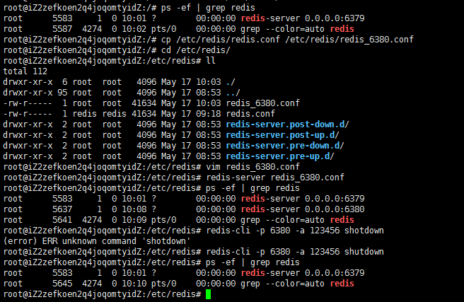
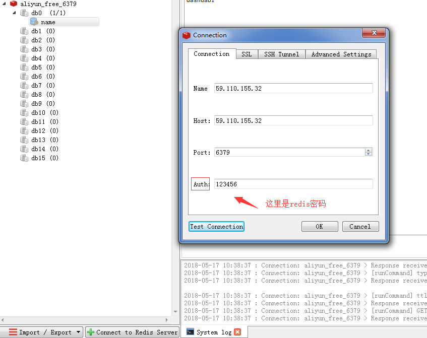

## Redis入门
---
注：下面$符号后面跟的都是命令！
### <font color=0099ff size=3>前言</font>
空闲时间，充实自己。从零开始重新认识redis。

### <font color=0099ff size=3>What is Redis?</font>
开源，原子性，速度快。

### <font color=0099ff size=3>安装Redis</font>

#### 系统环境
阿里云服务器 Ubuntu 16.04.3 LTS 

#### 安装Redis，基础配置，使用
1.安装redis，使用以下命令
```
$ sudo apt-get update
$ sudo apt-get install redis-server
```
ps:安装完成后，通过命令`whereis redis`找到redis相关文件在哪,通常是在`/etc/redis`


2.配置，让客户端可以远程访问
```
$ vim /etc/redis/redis.conf
```
修改下面两个参数[bind和daemonize]：
```
# bind 127.0.0.1 
bind 0.0.0.0  # 注释掉`bind 127.0.0.1`这行，加上`bind 0.0.0.0`，让客户端可以远程访问
daemonize yes  # 修改这一项，no改为yes，让redis在后台运行（以守护进程方式运行）
requirepass 123456  # 设置redis密码为：123456
```

ps:如果不远程访问，可跳过这一步

3.启动Redis
直接启动
```
$ redis-server /etc/redis/redis.conf  # 根据配置文件启动某个redis，这里启动默认的，端口为6379
```

4.查看 redis 是否启动？
```
$ redis-cli
```
以上命令将打开以下终端：
```
redis 127.0.0.1:6379>
```
上面127.0.0.1 是本机 IP ，6379 是 redis 服务端口。现在我们输入 PING 命令。
```
redis 127.0.0.1:6379> ping
PONG
```
以上说明我们已经成功安装了redis。

5.关闭Redis
```
$ ps -ef | grep redis  # 查看已启动的redis
$ redis-cli -p 6379 -a 123456 shutdown  # 通过客户端关闭端口为6379,密码为123456的redis
$ kill -9 5311  # 通过杀进程的方式关闭指定redis实例
```

6.同一台机器启动多个实例redis
这里，方便学习，我们创建一个端口号为`6380`的redis实例。具体操作步骤如下：

```
$ ps -ef | grep redis  # 这里查看redis进程，是没有6380的
$ cp /etc/redis/redis.conf /etc/redis/redis_6380.conf
$ cd /etc/redis/ 
$ ll
$ vim redis_6380.conf # 修改配置文件，具体修改，参见下面ps部分
$ redis-server /etc/redis/redis_6380.conf  # 根据端口为6380的redis
$ ps -ef | grep redis  # 这里查看redis进程，会发现多了一个6380的，说明端口号为6380的redis启动成功
$ redis-cli -p 6380 -a 123456 shutdown # 关闭
```

ps: 
vim redis_6380.conf:需要修改以下4点

```
port 6380  # Redis监听端口
pidfile /var/run/redis/redis-server-6380.pid  # 当Redis以守护进程方式运行时，Redis默认会把pid写入/var/run/redis.pid文件，可以通过pidfile指定
logfile /var/log/redis/redis-server-6380.log  # 日志记录方式
dbfilename dump_6380.rdb  # 指定本地数据库文件名
```

附上新建redis实例操作截图：


#### 使用Redis可视化工具远程连接
可视化工具：redis desktop manager
ps:工具自行下载安装，连接。百度就好了，很简单。注意一点，如果设置了redis密码，连接时记得填写Auth项。如下图：


#### 总结
一般可视化工具只是拿来查看数据。涉及到`redis`命令，比如get，set等，还是要自己在终端多敲一下，熟悉起来也更快！